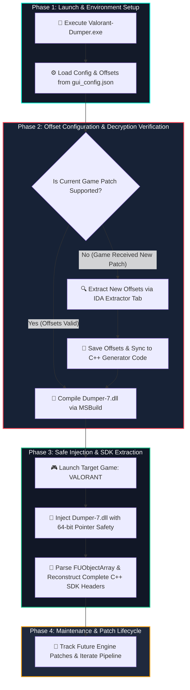
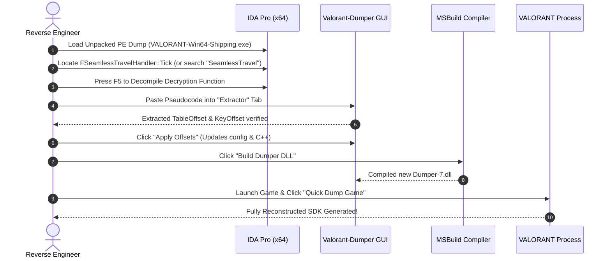
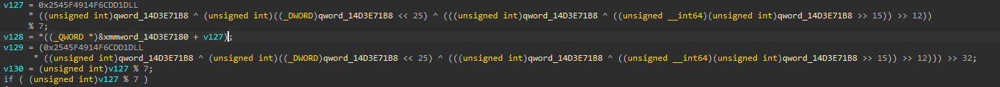
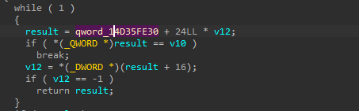

# 🛡️ Valorant SDK Dumper Pro: Comprehensive Project Guide
### Software Architecture, Programming Language Stack, Operational Manual & Patch Updating

<div align="center">


</div>

---

## 📸 Workflow Architecture & Lifecycle

The interactive diagram below illustrates the complete lifecycle of the software—from initial configuration to dynamic decryption, SDK generation, and recurring patch updates:



---

## 🎥 Video Tutorial & Demonstration

Watch the complete operational video walkthrough and feature demonstration of the **Valorant SDK Dumper Suite** in action:

<div align="center">

[-FF4655?style=for-the-badge&logo=googleplay&logoColor=white)](https://streamable.com/jsm3ph)

<br/><br/>

> 🎬 **Direct Link:** **[https://streamable.com/jsm3ph](https://streamable.com/jsm3ph)**

</div>

---


## 💻 Technology Stack & Programming Languages

This project incorporates a multi-tier engineering architecture, pairing low-level systems programming with a reactive desktop management suite:

| Language / Technology | Standard / Version | Project Source Directory | Key Architectural Responsibilities |
| :--- | :--- | :--- | :--- |
| **C++** | ISO C++20 (MSVC v143) | [`Dumper-7-7.0.1/Dumper/`](file:///c:/Users/Zero0/Downloads/Valorant-Dumper/Dumper-7-7.0.1/Dumper/) | Core injection DLL engine; raw memory pointer manipulation, 64-bit modulo decryption of `FUObjectArray`, Unreal Engine RTTI traversal, and syntactic C++ header generation. |
| **Python** | Python 3.10 – 3.13 | [`gui/`](file:///c:/Users/Zero0/Downloads/Valorant-Dumper/gui/) & [`run_gui.py`](file:///c:/Users/Zero0/Downloads/Valorant-Dumper/run_gui.py) | Modern Desktop GUI layer, asynchronous worker threads (`QThread`), real-time colored compilation streaming, and IDA decompiled pseudocode parser. |
| **PyQt6** | Qt 6.x Framework | [`gui/`](file:///c:/Users/Zero0/Downloads/Valorant-Dumper/gui/) | High-performance hardware-accelerated desktop UI components, layouts, custom title bar styling, and native Per-Monitor High-DPI scaling. |
| **x86-64 Assembly** | AMD64 Instruction Set | Disassembly & Reverse Engineering Docs | Binary inspection inside IDA Pro/Ghidra; calculating RIP-relative displacement (`[rip + offset]`), bitwise circular rotations (`ROR`/`ROL`), and 64-bit multiplication shifts (`IMUL`). |
| **Windows Batch (.bat)** | Windows Command Script | [`Launch-GUI.bat`](file:///c:/Users/Zero0/Downloads/Valorant-Dumper/Launch-GUI.bat), [`Build-Executable.bat`](file:///c:/Users/Zero0/Downloads/Valorant-Dumper/Build-Executable.bat), [`Build-Dumper-7.bat`](file:///c:/Users/Zero0/Downloads/Valorant-Dumper/Build-Dumper-7.bat) | Toolchain automation, environment discovery (`vswhere.exe`), zero-config standalone executable compilation, and MSBuild automation. |
| **QSS / CSS3** | Custom Qt Stylesheets | [`gui/theme.py`](file:///c:/Users/Zero0/Downloads/Valorant-Dumper/gui/theme.py) | Custom Cyberpunk & Valorant-inspired dark design system with vibrant neon accents (`#FF4655` red and `#00F5D4` cyan). |
| **JSON** | Standard UTF-8 | [`gui_config.json`](file:///c:/Users/Zero0/Downloads/Valorant-Dumper/gui_config.json) | Persistent configuration store for MSBuild paths, target process metadata, and active memory offsets across sessions. |

---

### 🔍 Deep Dive: Core Roles of Each Language

#### 1. C++ (Modern C++20):
- **Purpose:** Executes directly inside the game's address space as a 64-bit Dynamic Link Library (`Dumper-7.dll`).
- **Core Operations:**
  - High-performance pointer arithmetic (`uintptr_t`, `reinterpret_cast`) without garbage collection overhead.
  - Implementation of Valorant's proprietary 7 switch-case mathematical decryption algorithm for `FUObjectArray`.
  - Memory read validation via [`Platform::IsBadReadPtr`](file:///c:/Users/Zero0/Downloads/Valorant-Dumper/Dumper-7-7.0.1/Dumper/Engine/Private/Platform/Windows/Platform.cpp) to prevent access violation crashes (`STATUS_ACCESS_VIOLATION`) when inspecting unmapped memory pages.
  - Serialization and reconstruction of class inheritance hierarchies, virtual method tables (VTables), property bitmasks, and struct member alignments.

#### 2. Python 3 & PyQt6:
- **Purpose:** Delivers a complete, user-friendly control suite that eliminates the need for manual command-line interaction.
- **Core Operations:**
  - Dynamic discovery of MSBuild and Visual Studio toolchains via `vswhere`.
  - Regular Expression engine that parses raw IDA Pro C++ pseudocode to automatically extract Hexadecimal addresses (`TableOffset`, `KeyOffset`).
  - Python-based mathematical simulation of the 64-bit decryption routine to verify offsets before compilation.
  - Process lifecycle management, memory telemetry, and thread-safe process polling.

#### 3. x86-64 Assembly:
- **Purpose:** Understanding and translating machine code instructions during static and dynamic binary analysis.
- **Core Operations:**
  - Resolving RIP-relative operands: `LEA RAX, [RIP + 0xXXXXXXXX]` to identify the dynamic 7-element global pointer array.
  - Identifying cryptographic arithmetic operations: 64-bit integer multiplication (`imul`), bit rotations (`ror`, `rol`), logical XOR (`xor`), and bit shifting (`shr`, `shl`).

---

## 🚀 User Operation Manual

### 📌 How to Launch the Application:
You can start the application using any of the following three methods:

1. **Standalone Executable (Recommended):**
   - Double-click [`Valorant-Dumper.exe`](file:///c:/Users/Zero0/Downloads/Valorant-Dumper/Valorant-Dumper.exe) (features the custom embedded cat icon and runs without a console window).
2. **One-Click Batch Launcher:**
   - Double-click [`Launch-GUI.bat`](file:///c:/Users/Zero0/Downloads/Valorant-Dumper/Launch-GUI.bat).
3. **Python Interpreter (Developer Mode):**
   ```powershell
   python run_gui.py
   ```

---

### 🖥️ Overview of the 6 Application Tabs:

```text
┌────────────────────────────────────────────────────────────────────────┐
│  VALORANT SDK DUMPER PRO                                  [—] [□] [✕] │
├────────────────────────────────────────────────────────────────────────┤
│ [ 🔨 Build ] [ 🎯 Offsets ] [ 🔍 Extractor ] [ 💉 Injector ] [ 📊 Logs ] [ 📚 SDK ] │
├────────────────────────────────────────────────────────────────────────┤
│                                                                        │
│   Active Tab Controls, Diagnostic Telemetry, and Interactive Guides    │
│                                                                        │
└────────────────────────────────────────────────────────────────────────┘
```

#### 1. 🔨 Build Engine Tab
- Automatically discovers installed **Visual Studio 2022** and `MSBuild.exe` instances.
- Allows configuration selection (`Release` / `x64` / `v143`).
- **"Build Dumper DLL" button:** Compiles [`Dumper-7.dll`](file:///c:/Users/Zero0/Downloads/Valorant-Dumper/Dumper-7.dll) with real-time colored log streaming.
- **"Quick Dump Game" button:** Injects the newly compiled DLL directly into the active game process with a single click.

#### 2. 🎯 Offsets & Decryptor Math Tab
- Displays and edits currently active memory offsets:
  - `TableOffset`: Base offset of the 7-element pointer table for `FUObjectArray`.
  - `KeyOffset`: Base offset of the dynamic 32-bit decryption key.
  - `GWorldOffset`: Offset pointing to the active `UWorld` root container.
  - `FNamePoolOffset`: Offset pointing to the global string name registry (`GNames`).
- **Live Math Simulator:** Enter any 32-bit test key and instantly preview the resulting 64-bit decrypted pointer table index and mathematical transformation.
- **"Apply & Save Offsets" button:** Saves updates into [`gui_config.json`](file:///c:/Users/Zero0/Downloads/Valorant-Dumper/gui_config.json) and synchronizes C++ source files.

#### 3. 🔍 IDA Pseudocode Extractor Tab
- Simplifies offset updating after new game patches.
- Paste decompiled C++ pseudocode (from `FSeamlessTravelHandler::Tick` in IDA Pro) directly into the input editor.
- Click **"Extract Offsets"**: The software automatically parses `TableOffset` and `KeyOffset`, displays them in clean Hex formatting, and allows you to apply them immediately.

#### 4. 💉 Safe DLL Injector Tab
- Automatically enumerates running processes to detect `VALORANT-Win64-Shipping.exe`.
- Performs safe 64-bit DLL injection utilizing `LoadLibraryW` + `CreateRemoteThread` with automatic `SeDebugPrivilege` escalation.
- Includes an **"Eject DLL"** function (`FreeLibrary`) allowing you to unload the DLL cleanly and re-inject a new build without restarting the game.

#### 5. 📊 Process Monitor & Diagnostics Tab
- Displays live metrics including process ID (PID), memory usage (Working Set & Private Bytes), thread count, and parent process hierarchy.
- Provides historical log inspection and verification of generated output files.

#### 6. 📚 SDK Header Explorer Tab
- Built-in code browser designed to inspect generated Unreal Engine C++ header files (`.hpp` / `.cpp`).
- Features a real-time search and filter bar to instantly locate specific class definitions (e.g., `AresClient`, `ShooterCharacter`, `World`).

---

## 🔄 Step-by-Step Patch Update Guide (Reverse Engineering Workflow)

Whenever Riot Games releases a patch for Valorant, memory offsets change. Follow this standard reverse engineering workflow to update the tool in minutes:



### 🎯 Memory Signatures (AOB Patterns) for IDA Pro

To immediately locate the required decryption routines and offsets without manual cross-reference searching, use the following Byte Signatures (`Alt + B` in IDA Pro):

| Target Component | Pattern Signature (AOB / Sequence of Bytes) | Extracted Offsets |
| :--- | :--- | :--- |
| **`GWorld` (`UWorld*`)** | `48 8D 04 CA 4C 39 08 74 ? 8B 48 ? 83 F9 ? 75 ? EB` | `GWorldOffset` |
| **`GObject` (`FUObjectArray`)** | `41 2B D0 49 BC ? ? ? ? ? ? ? ? 0F 85 ? ? ? ? 8D 4B` | `TableOffset`, `KeyOffset` |

---

### 📋 Detailed Step-by-Step Walkthrough:

#### 1. Step 1: Obtain a Clean Memory Dump
- Dump the unpacked `VALORANT-Win64-Shipping.exe` from protected memory using your preferred memory dumper (ensuring valid PE headers, `.text`, `.rdata`, and `.data` sections).

#### 2. Step 2: Load into IDA Pro (x64)
- Open the dumped binary in IDA Pro x64.
- Select `Portable Executable (PE) [pe64.dll]` and wait until the status bar shows **`AU: idle`**.
- Default Image Base in IDA is typically `0x140000000`.

---

#### 3. Step 3: Locate & Extract `GObject` (`TableOffset` & `KeyOffset`)

`FUObjectArray` uses a dynamic 7-case mathematical decryption routine. To locate it and extract both offsets:

1. **Search with Pattern Signature:**
   - In IDA Pro, press **`Alt + B`** (Search -> Sequence of bytes...).
   - Paste the GObject signature:
     ```text
     41 2B D0 49 BC ? ? ? ? ? ? ? ? 0F 85 ? ? ? ? 8D 4B
     ```
   *(Alternative: Search for the 64-bit magic multiplication constant in little-endian: `1D DD 6C 4F 91 F4 45 25`)*
2. **Decompile with Hex-Rays (`F5`):**
   - Press **`F5`** to decompile the routine into C pseudocode.
   - You will see the modulo 7 (`% 7`) operation and the pointer array access as shown below:

<div align="center">



</div>

```c
v127 = 0x2545F4914F6CDD1DLL
  * ((unsigned int)qword_14D3E71B8 ^ (unsigned int)((_DWORD)qword_14D3E71B8 << 25) ^ (((unsigned int)qword_14D3E71B8 ^ ((unsigned __int64)(unsigned int)qword_14D3E71B8 >> 15)) >> 12))
  % 7;
v128 = *((_QWORD *)&xmmword_14D3E7180 + v127);
v129 = (0x2545F4914F6CDD1DLL
  * ((unsigned int)qword_14D3E71B8 ^ (unsigned int)((_DWORD)qword_14D3E71B8 << 25) ^ (((unsigned int)qword_14D3E71B8 ^ ((unsigned __int64)(unsigned int)qword_14D3E71B8 >> 15)) >> 12))) >> 32;
v130 = (unsigned int)v127 % 7;
if ( (unsigned int)v127 % 7 )
```

3. **Identifying the Target Variables:**
   - **`KeyOffset`:** Look at the variable being shifted and multiplied: `qword_14D3E71B8` (or `dword_...`).
   - **`TableOffset`:** Look at the pointer array base being indexed: `xmmword_14D3E7180`.

4. **Calculating Relative Offsets:**
   $$\text{Relative Offset} = \text{Virtual Address (IDA)} - \text{Image Base (0x140000000)}$$

   | Field | IDA Virtual Address | Calculation | Extracted Relative Offset |
   | :--- | :--- | :--- | :--- |
   | **`TableOffset`** | `0x14D3E7180` | `0x14D3E7180 - 0x140000000` | **`0xD3E7180`** |
   | **`KeyOffset`** | `0x14D3E71B8` | `0x14D3E71B8 - 0x140000000` | **`0xD3E71B8`** |

> [!TIP]
> **Automatic Extraction:** You don't have to calculate this manually! Simply copy this decompiled C block, switch to the **"Extractor"** tab in [`Valorant-Dumper.exe`](file:///c:/Users/Zero0/Downloads/Valorant-Dumper/Valorant-Dumper.exe), paste the code, and click **"Extract Offsets"**.

---

#### 4. Step 4: Locate & Extract `GWorld` (`GWorldOffset`)

`GWorld` holds the root `UWorld*` container representing the active map and game actors:

1. **Search with Pattern Signature:**
   - In IDA Pro, press **`Alt + B`** (Search -> Sequence of bytes...).
   - Paste the GWorld signature:
     ```text
     48 8D 04 CA 4C 39 08 74 ? 8B 48 ? 83 F9 ? 75 ? EB
     ```
2. **Decompile with Hex-Rays (`F5`):**
   - Press **`F5`** to view the decompiled loop responsible for world context enumeration:

<div align="center">



</div>

```c
while ( 1 )
{
  result = qword_14D35FE30 + 24LL * v12;
  if ( *(_QWORD *)result == v10 )
    break;
  v12 = *(_DWORD *)(result + 16);
  if ( v12 == -1 )
    return result;
}
```

3. **Identifying the Target Variable:**
   - Look at the base pointer in the iteration: `qword_14D35FE30`.

4. **Calculating Relative Offset:**
   $$\text{GWorldOffset} = \text{Virtual Address (IDA)} - \text{Image Base (0x140000000)}$$

   | Field | IDA Virtual Address | Calculation | Extracted Relative Offset |
   | :--- | :--- | :--- | :--- |
   | **`GWorldOffset`** | `0x14D35FE30` | `0x14D35FE30 - 0x140000000` | **`0xD35FE30`** |

---

#### 5. Step 5: Apply Offsets to Project
1. **Via GUI (Easiest):**
   - Go to the **"Offsets"** tab in [`Valorant-Dumper.exe`](file:///c:/Users/Zero0/Downloads/Valorant-Dumper/Valorant-Dumper.exe).
   - Enter `TableOffset`, `KeyOffset`, and `GWorldOffset`.
   - Click **"Apply & Save Offsets"** (automatically writes to [`gui_config.json`](file:///c:/Users/Zero0/Downloads/Valorant-Dumper/gui_config.json) and synchronizes C++ generator code).
2. **Via Source Code:**
   - Verify offsets in [`Generator.cpp`](file:///c:/Users/Zero0/Downloads/Valorant-Dumper/Dumper-7-7.0.1/Dumper/Generator/Private/Generators/Generator.cpp) inside `Generator::InitEngineCore()`.

---

#### 6. Step 6: Recompile & Dump
1. Go to the **"Build"** tab and click **"Build Dumper DLL"** (or run [`Build-Dumper-7.bat`](file:///c:/Users/Zero0/Downloads/Valorant-Dumper/Build-Dumper-7.bat)).
2. Launch the game, enter **The Range** map, and click **"Quick Dump Game"** (or use the **"Injector"** tab).
3. Check the generated SDK in the output directory!


---

## 🛠️ Project Toolchain & Build Automation Scripts

| Script / Artifact | Description & Usage |
| :--- | :--- |
| **[`Valorant-Dumper.exe`](file:///c:/Users/Zero0/Downloads/Valorant-Dumper/Valorant-Dumper.exe)** | Compiled, standalone desktop application packaged with all dependencies and custom branding. |
| **[`Build-Executable.bat`](file:///c:/Users/Zero0/Downloads/Valorant-Dumper/Build-Executable.bat)** | One-click PyInstaller packaging script; compiles `run_gui.py` into a single standalone `.exe`, embeds `cat.ico`, copies output to root, and cleans intermediate build directories. |
| **[`Build-Dumper-7.bat`](file:///c:/Users/Zero0/Downloads/Valorant-Dumper/Build-Dumper-7.bat)** | Standalone MSBuild compilation batch script; detects Visual Studio 2022, builds `Dumper-7.vcxproj`, and copies `Dumper-7.dll` to root. |
| **[`Launch-GUI.bat`](file:///c:/Users/Zero0/Downloads/Valorant-Dumper/Launch-GUI.bat)** | Smart launcher script; executes `Valorant-Dumper.exe` if present, or falls back to running `python run_gui.py`. |

---

<div align="center">
  <b>Valorant SDK Dumper Suite • Engineered with precision by yousef_zero</b>
</div>
